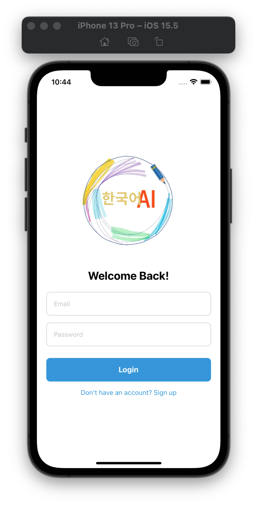
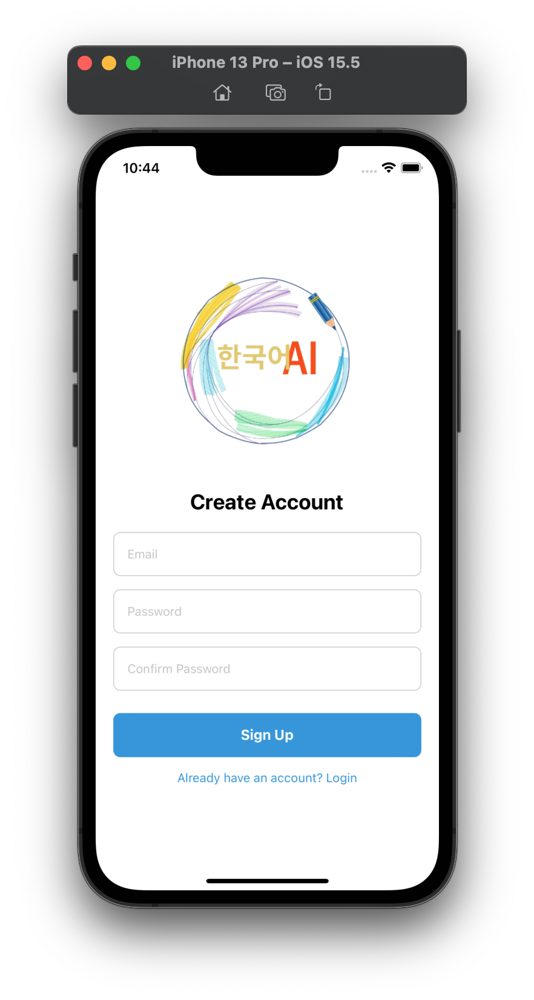
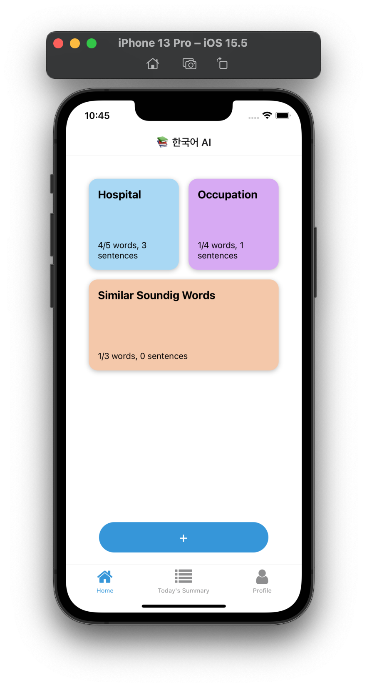
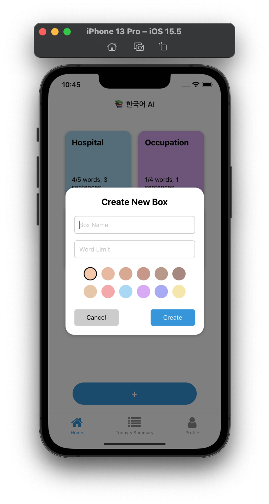
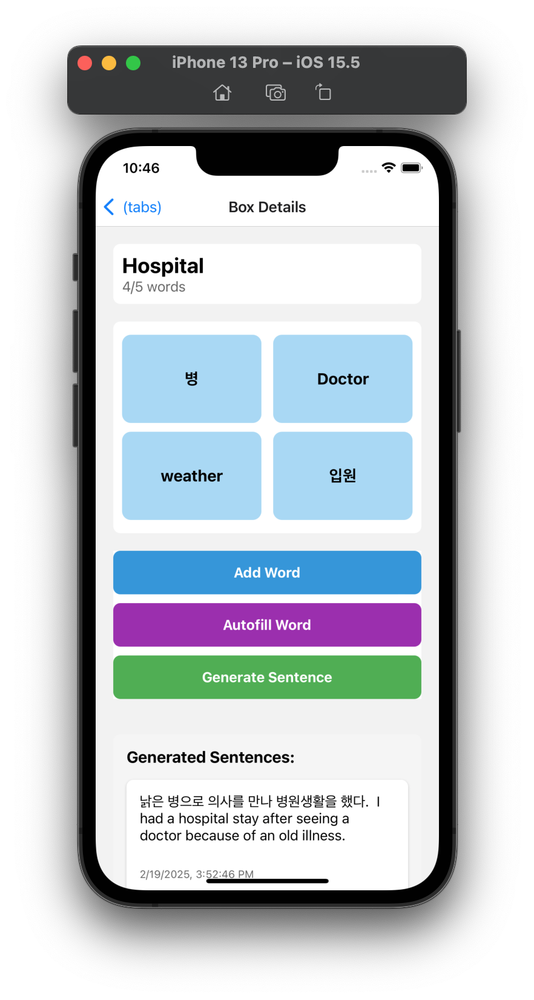
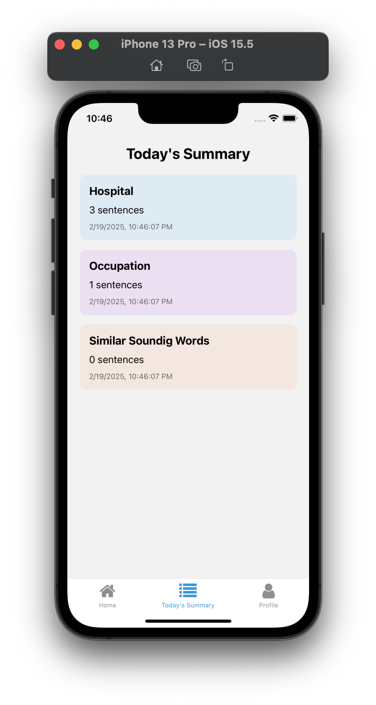
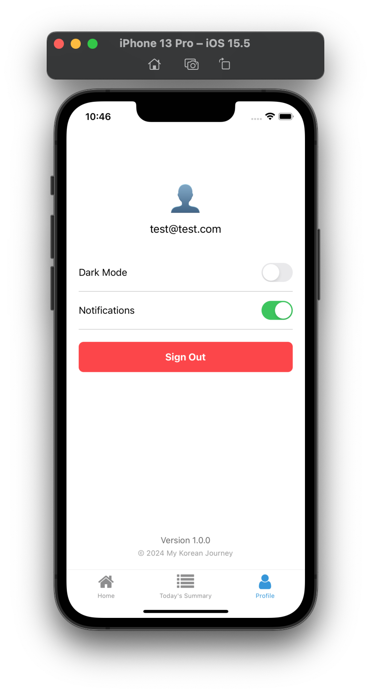

# 📚 한국어 AI

## A Mobile App for Mastering Korean

### WHY 📚 한국어 AI?

Learning Korean over the past three months has been a challenging yet rewarding journey. One of the biggest hurdles I've faced is remembering words that sound similar but have different meanings. I realized that capturing words within the same context could significantly enhance my memory retention. Additionally, I found many flashcard applications to be costly and lacking in personalized learning experiences.

Thus, I created 📚 한국어 AI, an application designed not only for myself but for anyone eager to learn Korean with the help of AI. This app allows users to create word boxes with a specified word limit. If a user enters fewer words than the limit, 📚 한국어 AI suggests additional words that fit the context or sound similar to the existing ones. Moreover, 📚 한국어 AI generates sentences using the words in the boxes, providing both Korean sentences and their English translations. This ensures that users not only learn individual words but also understand how to use them in sentences.

### Features

- User registration, login, and logout
- Create, read, and hold(long press) to edit, and delete word boxes and word cards
- Flip Korean word cards to see their English translations
- Autofill word button generates contextually relevant words
- Generate sentence button creates Korean sentences with English translations using the word cards in a specific box

### Screenshots

<table>
    <tr>
        <td></td>
        <td></td>
        <td></td>
        <td></td>
    </tr>
    <tr>
        <td></td>
        <td></td>
        <td></td>
        <td></td>
    </tr>
</table>

### Installation

1. **Clone the repository:**

```sh
git clone https://github.com/yourusername/korean-lang-app.git
cd korean-lang-app
```

2. **Install dependencie**

```ssh
yarn install
```

3. **Set up environment variable**

```ssh
FIREBASE_API_KEY=your_api_key
FIREBASE_AUTH_DOMAIN=your_auth_domain
FIREBASE_PROJECT_ID=your_project_id
FIREBASE_STORAGE_BUCKET=your_storage_bucket
FIREBASE_MESSAGING_SENDER_ID=your_messaging_sender_id
FIREBASE_APP_ID=your_app_id
GEMINI_API_KEY=your_gemini_api_key
```

4. **Start the application**

```ssh
yarn start
```

### Upcoming Features

- Real-time notifications
- Backup and restore functionality
- Save all word box histories as PDF
- Share word boxes with the community
- Like, share, and comment interactions

### License

This project is licensed under the MIT License - see the LICENSE file for details.

---

Thank you for using 📚 한국어 AI! We hope it helps you on your journey to mastering Korean. If you have any questions or feedback, please feel free to open an issue or contact us.
